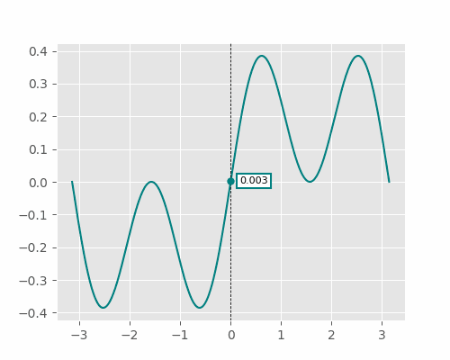

# mpl-markers

Interactive data and axis markers for 2D line plots in matplotlib

## Installation

```bash
pip install mpl-markers
```

## Usage

```python
import mpl_markers as mplm
```

Add a marker attached to plotted data lines:
```python
import numpy as np
import matplotlib.pyplot as plt

fig, ax = plt.subplots(1,1)
x1 = np.linspace(-2*np.pi, 2*np.pi, 1000)

ax.plot(x1, np.sin(x1), label='sin(x)')
ax.plot(x1, np.cos(x1), label='cos(x)')
ax.legend()

mplm.data_marker(x=0)
```


Add an axis marker that moves freely on the canvas:
```python
mplm.axis_marker(x=0, y=-0.5)
```


